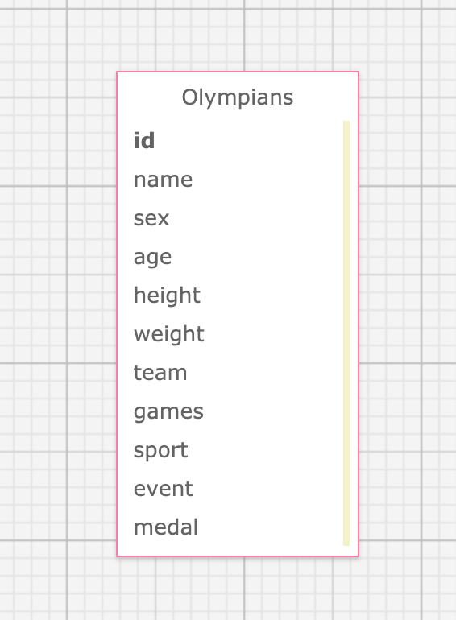

# Olympians


## About the Project
A solo project (take home code challenge) completed in 2 days in Module 4 of Backend Engineering at Turing School of Software and Design.

This app imports a large CSV file containing historical data from the 2016 Summer Olympics and exposes analytical endpoints.

Deployed app: (https://express-olympians.herokuapp.com/)

## Contributor
[Smitha Hosmani](https://github.com/hsmitha26)

## Schema


## Tech Stack
* [Express for Node.js](https://expressjs.com/)
* [JavaScript](https://devdocs.io/javascript/)
* [Jest](https://jestjs.io/)
* [Knex.js](http://knexjs.org/)
* [PostgreSQL](https://www.postgresql.org/)

## Setup
* `git clone git@github.com:hsmitha26/olympians.git`
* `npm install`

To run the tests: `npm test`

To run the local server: `npm start`
* local server: `http://localhost:3000`
* production: `https://express-weather-forecast.herokuapp.com/`

## Postman
In Postman, append the (local or production) url to expose the below endpoints or click the `Run in Postman` button to import the collection of endpoints.

[](https://app.getpostman.com/run-collection/431c5d56702fe4be71e2)

## Endpoints

### GET api/v1/olympians
#### Response:
  ```
  {
  "olympians":
    [
      {
        "name": "Maha Abdalsalam",
        "team": "Egypt",
        "age": 18,
        "sport": "Diving"
        "total_medals_won": 0
      },
      {
        "name": "Ahmad Abughaush",
        "team": "Jordan",
        "age": 20,
        "sport": "Taekwondo"
        "total_medals_won": 1
      },
      {...}
    ]
  }
  ```

### GET api/v1/olympians?age=youngest
#### Response:
```
{
    "youngestOlympian": [
        {
            "name": "Ana Iulia Dascl",
            "team": "Romania",
            "age": 13,
            "sport": "Swimming",
            "total_medals_won": "0"
        }
    ]
}
```
</details>

### GET api/v1/olympians?age=oldest
#### Response:
```
{
    "oldestOlympian": [
        {
            "name": "Julie Brougham",
            "team": "New Zealand",
            "age": 62,
            "sport": "Equestrianism",
            "total_medals_won": "0"
        }
    ]
}
```

### GET api/v1/olympian_stats
#### Response:
```
{
    "olympian_stats": {
        "total_competing_olympians": "2850",
        "average_male_weight_in_kgs": "79",
        "average_female_weight_in_kgs": "62",
        "average_age": "26.2"
    }
}
```

## Known Issues
* Currently a successful response is not an exact match to the spec. After adding serializer and implementing MVC design pattern, this issue will be resolved.
* Error messages will be added at a later time.
